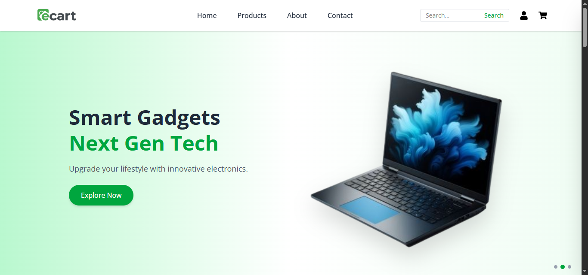

# E-Cart — MERN E-commerce Application

A full-stack E-commerce web application built using the MERN stack. The platform enables users to explore products, manage carts, and place orders securely, while providing an admin dashboard for complete store management.

---

## Live Demo

https://mern-ecommerce-app-sandy.vercel.app/

---

## Key Highlights

* Implemented secure user authentication using JWT
* Designed a responsive and user-friendly UI with React and Tailwind CSS
* Built RESTful APIs for scalable backend architecture
* Developed a complete cart and order management system
* Created an admin dashboard to manage products, users, and orders

---

## Features

* User Signup and Login with authentication
* Product browsing with filtering
* Add to cart and cart management
* Order placement workflow

### Admin Panel

* Product management
* User management
* Order tracking

---

## Tech Stack

**Frontend:**
React.js, Tailwind CSS

**Backend:**
Node.js, Express.js

**Database:**
MongoDB

**Other:**
JWT Authentication, REST APIs

---

## Project Architecture

* Modular backend structure (routes, controllers, models)
* REST API integration with frontend
* State management using React hooks
* Secure authentication flow using tokens

---

## Screenshots

### Home Page

### Product Page

### Cart Page

### Admin Dashboard

---

## Future Enhancements

* Payment gateway integration (Stripe / Razorpay)
* Order tracking system
* Product reviews and ratings
* Email notifications and alerts

---

## Author

Saurabh Kumar
MERN Stack Developer
